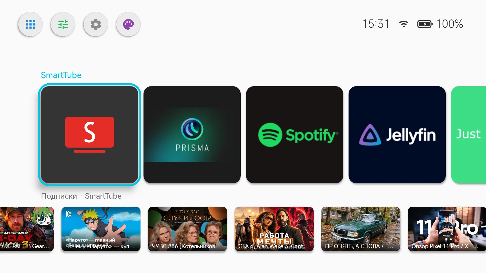
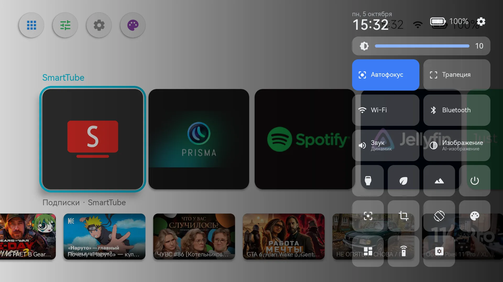
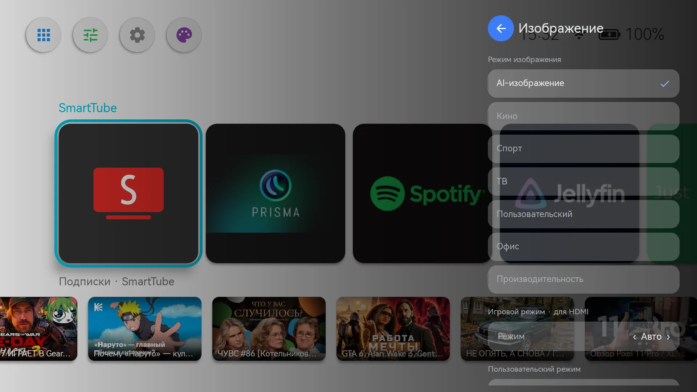
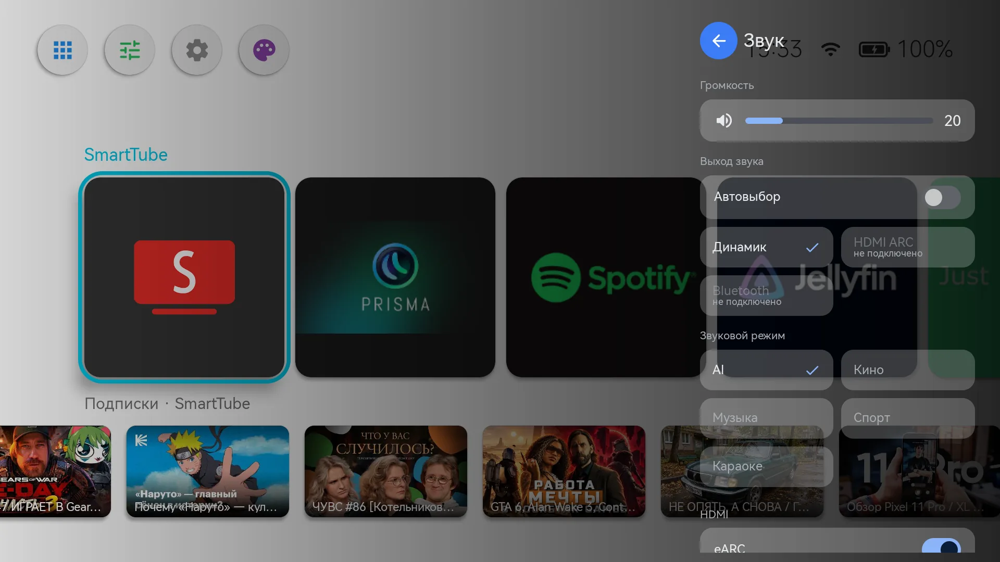

# Beam

A home screen (launcher) for the **XGIMI Play 6** projector (Android 11), written in Jetpack Compose.
It replaces XGIMI's stock shell with its Chinese services and ads. The firmware itself is left
alone: everything is installed and rolled back over adb.

The interface is available in Russian and English. The language is chosen inside Beam
(Appearance → Language), independently of the system language, because the projector's firmware
refuses English as a system language. Voice commands are Russian only.
[Русская версия](README.md)

> An unofficial project, not affiliated with XGIMI. Made only for the XGIMI Play 6 on Android 11.
> On other XGIMI models the projector functions (brightness, keystone, focus, battery) may not
> work; other devices are not supported.

## What it does

- **Home screen**: a row of app tiles ordered by how often you use them, plus HDMI and USB drive
  tiles. Below it a second row with other apps' channels (SmartTube subscriptions, recent Spotify,
  "Continue watching"). Also a "Now playing" widget and the projector's battery level.
- **Quick settings panel** over any app, opened with the remote's voice button: picture, sound,
  appearance, Bluetooth (including searching for and pairing speakers), screensaver, power and
  sleep timer, projection, keystone and picture size, XGIMI settings.
- **App buttons on the remote**: the firmware hard-wires four buttons to Chinese video services;
  they can be assigned to any app, to the panel, or to "home".
- **Offline voice search** on [Vosk](https://alphacephei.com/vosk/) (the small Russian model).
- Appearance: light and dark themes, backgrounds (including an animated PS3 XMB style one),
  interface sounds, interface language (system, Russian or English).

## Screenshots

The screenshots show the Russian interface.

| Home screen | Quick settings panel |
|---|---|
|  |  |

| Picture | Sound |
|---|---|
|  |  |

| Keystone and size | On-screen keystone setup |
|---|---|
|  |  |

## Installation

You need a computer with [adb](https://developer.android.com/tools/releases/platform-tools) and the
projector on the same network.

1. Enable developer mode and network debugging (ADB) on the projector. Turn off any VPN on the
   computer, otherwise adb can't reach the projector.
2. Download the APKs from the [Releases](https://github.com/tonisaf/beam-launcher/releases) page:
   `app-release.apk` (Beam) and the four `stub-button*-release.apk` (remote button stubs). Put them
   into `tools\apks\`, or pass the path to Beam with `-Apk`. You can also build them yourself (see
   [Building](#building)).
3. Run from the repository root (Windows PowerShell):

   ```powershell
   .\tools\restore.ps1 -Device 192.168.1.50 -Reboot
   ```

   The script can be run again; steps for apps that are absent are skipped. APKs to install along
   the way (SmartTube, LeanKey…) go into `tools\apks\`.

### What `restore.ps1` changes

Read this before running it:

- installs Beam and the remote button stubs (see below);
- **disables** (`pm disable-user`, nothing is uninstalled) the stock launcher `com.xgimi.home`, the
  Sogou keyboard, ads, telemetry, bug reporting, the Chinese app store, and XGIMI's voice and IoT
  services. The full list is in the script, section 2. The stock launcher is disabled only after
  Beam is installed and set as the home screen;
- makes LeanKey the system keyboard if it is installed;
- grants Beam permissions over adb: usage statistics, notification access (for "Now playing"), TV
  channels, `WRITE_SECURE_SETTINGS`, location (to search for Bluetooth devices), and modifying
  system settings;
- turns on Beam's accessibility service (added to the ones already enabled): it catches the voice
  button and draws the panel over apps. The firmware resets it on boot; Beam turns it back on by
  itself;
- makes Beam the home screen;
- sets the system language to Russian, the time zone to **Europe/Moscow** and the Bluetooth name to
  "XGIMI Play 6". Other values are set with `-Locale`, `-TimeZone`, `-BluetoothName` (or `LOCALE`,
  `TIMEZONE`, `BT_NAME` in `local.env`); `-SkipSystem` leaves these three settings alone. Note
  that the firmware won't accept English as the system language; use Beam's own language setting
  instead.

### Rolling back

```powershell
.\tools\restore.ps1 -Device 192.168.1.50 -Revert        # add -Reboot to reboot afterwards
```

The script enables everything it disabled (the stock launcher first), restores the system
keyboard, removes Beam from the accessibility services (the others stay) and from the speech
recognizers, and then removes the remote button stubs (only its own; real apps with the same
package names stay) and Beam itself. If the stock launcher can't be enabled, Beam is not removed,
so you don't end up without a home screen. The language, time zone and Bluetooth name are not
reverted: the previous values are unknown. If Projectivy is installed, it is enabled again too,
and the first time you press Home the system may ask which launcher to use.

The same by hand:

```sh
adb shell pm enable com.xgimi.home          # and the other packages from section 2 of restore.ps1
adb uninstall com.home.tiles
adb uninstall com.cibn.tv                   # remote button stubs
adb uninstall com.ktcp.tvvideo
adb uninstall com.gitvjimi.video
adb uninstall com.hunantv.license
```

After a reboot the home screen is the stock launcher again.

### Remote button stubs

The firmware handles the four app buttons on the remote itself and launches fixed Chinese apps by
package name. The `stub` module builds four tiny APKs **with those package names**
(`com.cibn.tv`, `com.ktcp.tvvideo`, `com.gitvjimi.video`, `com.hunantv.license`). They do nothing
except pass the key press to Beam. If the real apps with those package names are installed on the
projector, the stubs won't install.

### Voice model

The Vosk model (~45 MB) is not part of the APK and is not downloaded automatically: without it
the voice button only opens the panel. Install it once over adb (the microphone permission is
needed; `restore.ps1` grants it):

```sh
# the projector downloads the model itself (https only; add --es voice_sha256 <archive SHA-256> to verify):
adb shell am broadcast -n com.home.tiles/.AdbCommandReceiver \
    --es voice_url https://alphacephei.com/vosk/models/vosk-model-small-ru-0.22.zip
# or push the file from the computer (see `VoiceModelProvider` in `Voice.kt`):
adb exec-in "content write --uri content://com.home.tiles.voicemodel/model.zip" < vosk-model-small-ru-0.22.zip
adb shell am broadcast -n com.home.tiles/.AdbCommandReceiver --ez voice_install true
```

Voice commands open SmartTube, Spotify and Jellyfin (whichever of the known builds is installed;
apps that are not installed are not recognized). Your own apps are added over adb:

```sh
adb shell am broadcast -n com.home.tiles/.AdbCommandReceiver \
    --es voice_app "Kodi|org.xbmc.kodi|коди;открой коди"   # name | packages, comma-separated | phrases, separated by ;
adb shell am broadcast -n com.home.tiles/.AdbCommandReceiver --ez voice_apps true          # list the added ones
adb shell am broadcast -n com.home.tiles/.AdbCommandReceiver --es voice_app_remove Kodi    # remove one
```

The Vosk model is Russian, so write the phrases in Russian (the way they are pronounced). The
interface language doesn't affect voice: the commands are always Russian.

Beam also answers the standard speech recognition requests from other apps (`RECOGNIZE_SPEECH`,
`RecognitionService`). That means any installed app can get a transcript of what you say into the
remote's microphone while you hold the voice button, even if the app itself has no microphone
permission: that is how this Android mechanism works. Nothing is recorded unless the button is
held. If that is unacceptable, don't make Beam the recognizer and don't install the model.

To check: `--ez voice_status true`. To make the microphone buttons in other apps (for example
SmartTube) use Beam as well, set it as the system recognizer (optional):
`adb shell settings put secure voice_recognition_service com.home.tiles/com.home.tiles.VoskRecognitionService`.

## Building

You need JDK 17 and the Android SDK (the path in `ANDROID_HOME` or `local.properties`).

```sh
./gradlew :app:assembleRelease :stub:assembleRelease
```

The APKs appear in `app/build/outputs/apk/release/` and `stub/build/outputs/apk/*/release/`.

### Signing

Releases are signed with a permanent key that is kept outside the repository. Because of that, a
new version can be installed over an old one (`adb install -r`, settings are kept). Gradle takes the
key from `~/.beam/release.properties` (or from the file whose path is in `BEAM_RELEASE_PROPS`):

```properties
storeFile=C:/Users/you/.beam/beam-release.jks
storePassword=...
keyAlias=beam
keyPassword=...
```

The key is created once: `keytool -genkeypair -alias beam -keyalg RSA -keysize 4096 -validity 36500
-keystore beam-release.jks`. Keep a copy: if the key is lost, everyone has to uninstall Beam and
install it again. Without this file (in CI, for example) the build is signed with the computer's
debug key: it installs, but can't update a Beam signed with the real key, and vice versa. The
SHA-256 fingerprint of the release certificate:
`B0:A3:37:70:07:0C:3C:84:00:29:E1:D4:B3:4F:F3:CF:05:F0:A3:4B:97:41:7D:62:22:38:3E:95:9E:8C:20:F9`.

### Quick install during development

```sh
cp local.env.example local.env   # put in the projector's IP (and paths if adb is not on PATH)
./deploy.sh                      # build and install Beam
./deploy.sh --stubs              # the remote button stubs as well
./deploy.sh --no-start           # don't bring Beam to the screen after installing
```

`local.env` is not committed. Both `deploy.sh` and `tools/restore.ps1` read it.

### How Beam controls the projector

Which services, classes and settings of the XGIMI firmware Beam calls, and what in it doesn't work
the way you'd expect: [docs/xgimi-firmware.en.md](docs/xgimi-firmware.en.md).

### Debug commands

```sh
adb shell am broadcast -n com.home.tiles/.AdbCommandReceiver --es background XMB --ez bg_animation true
adb shell am broadcast -n com.home.tiles/.AdbCommandReceiver --es bt_name "XGIMI Play 6"
adb shell am start -n com.home.tiles/.MicTestActivity --ei seconds 6   # test the remote's microphone
```

## License

[MIT](LICENSE). The project is provided "as is", without warranty: `restore.ps1` changes the
projector's system settings, run it at your own risk.
