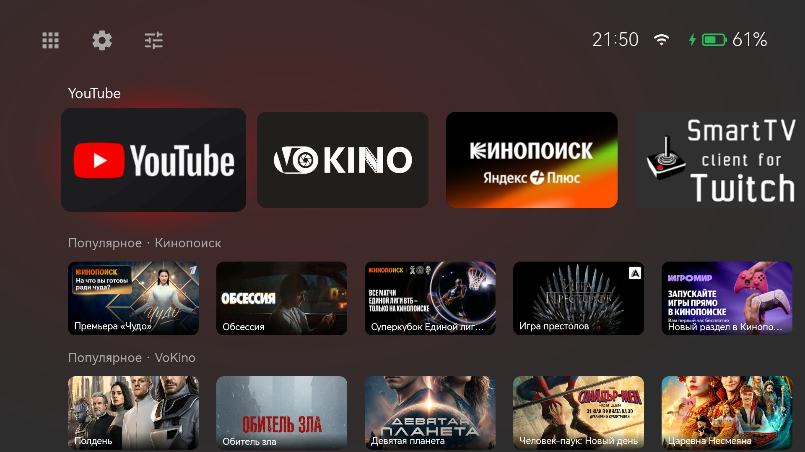
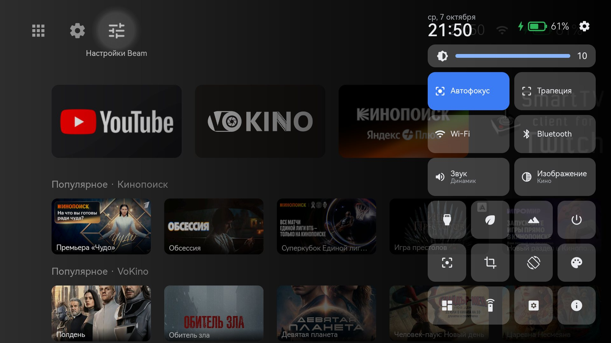
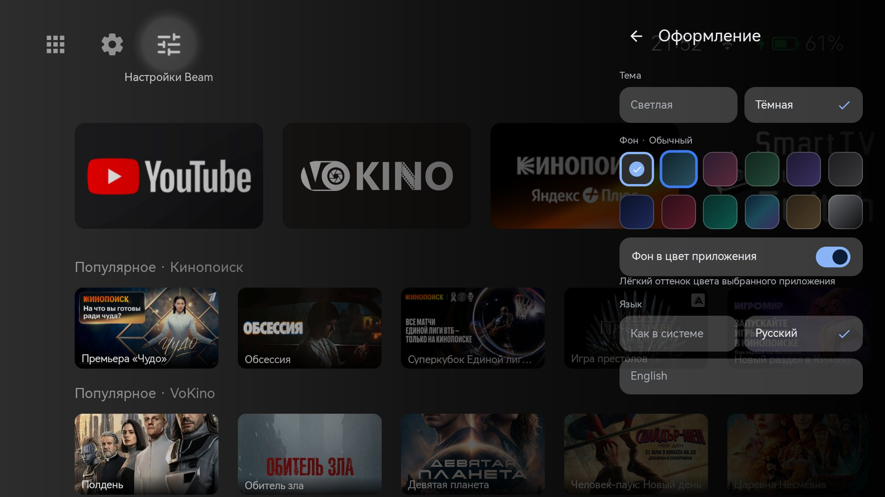
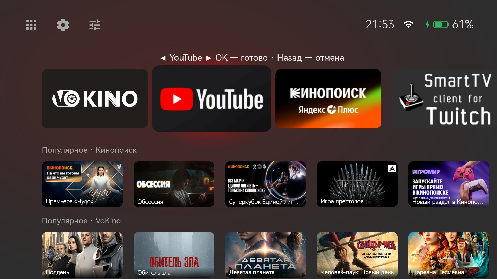
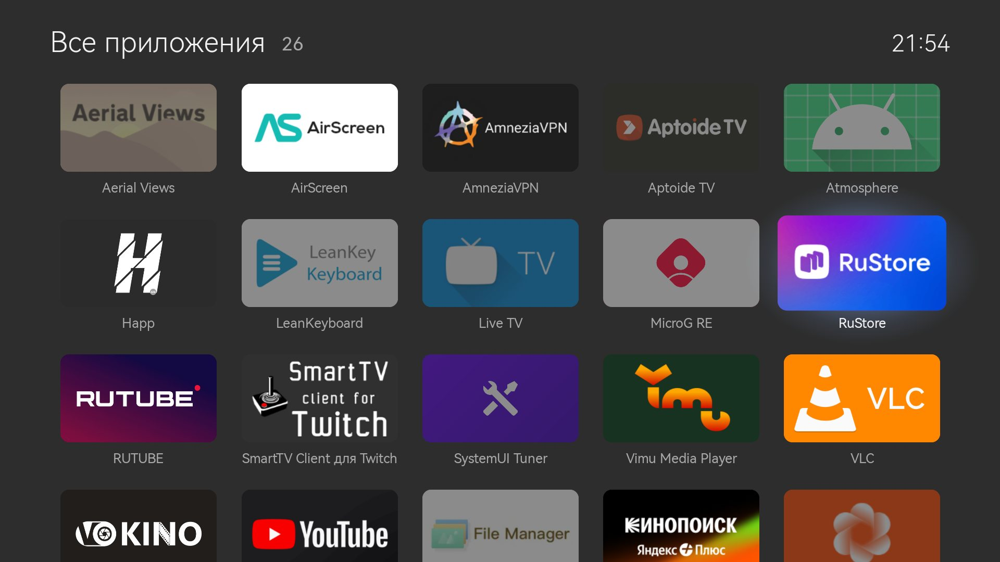
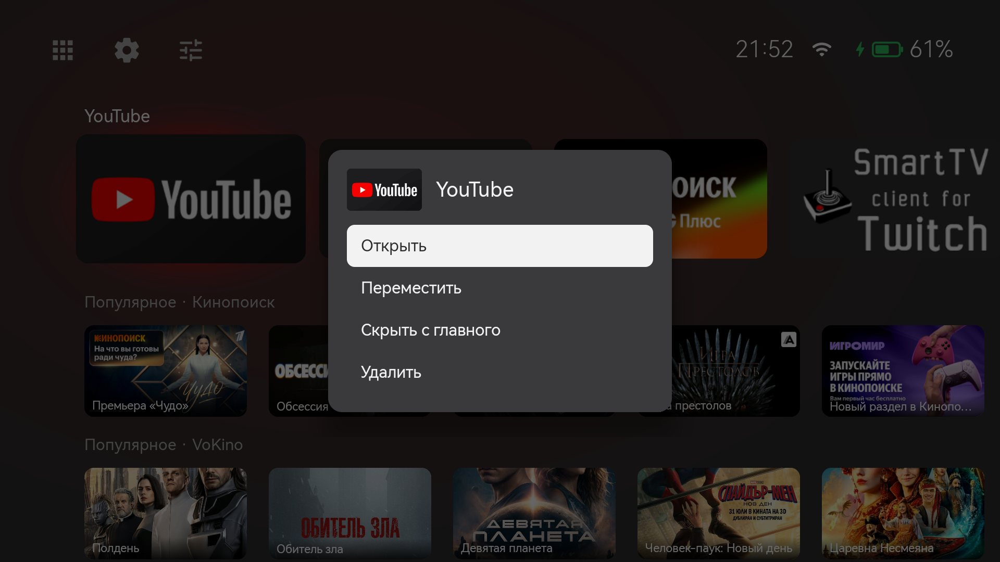

<p align="center"></p>

# Beam

Домашний экран (лаунчер) для проектора **XGIMI Play 6** (Android 11), написанный на Jetpack Compose. Он заменяет
стоковую оболочку XGIMI с китайскими сервисами и рекламой. Прошивку при этом не трогает: всё
ставится и откатывается через adb.

Интерфейс на русском и английском. Язык выбирается в Beam («Оформление» → «Язык») независимо от
языка системы: прошивка проектора не принимает английский как системный. Голосовые команды только
на русском. [English version](README.en.md)

> Неофициальный проект, никак не связанный с XGIMI. Сделан только для XGIMI Play 6 на Android 11.
> На других моделях XGIMI функции проектора (яркость, трапеция, фокус, батарея) могут не работать,
> другие устройства не поддерживаются.

## Эта сборка

Это модификация Beam от **Dobrein** на основе оригинала
[tonisaf/beam-launcher](https://github.com/tonisaf/beam-launcher) (автор — tonisaf). Версия и авторы
видны в самом лаунчере: панель настроек → «О Beam». Что изменено по сравнению с Beam 0.3:

**Главный экран**

- **Выбор как на Google TV**: выбранная плитка немного увеличивается, а за ней светится мягкий
  ореол в цвет приложения (красный у YouTube, оранжевый у Кинопоиска). При переходе ореол плавно
  перетекает с плитки на плитку. Голубой рамки и голубых подписей больше нет.
- **Фон в цвет приложения**: фон слегка окрашивается в цвет выбранного приложения. Выключается в
  «Оформлении».
- **Порядок плиток задаётся вручную**: зажать OK → «Переместить», ◀ ▶ двигают плитку, OK —
  готово, Назад — отмена. Плитки сдвигаются плавно, ряд прокручивается следом. Автосортировки по
  использованию нет, как на Google TV; новые приложения встают в конец. Плитки HDMI и USB тоже
  можно двигать и скрывать.
- **Меню по зажатию OK**: Открыть · Переместить · Скрыть с главного · Удалить. Отпускание OK больше
  не открывает приложение (и во «Всех приложениях» тоже).
- **Плитки 16:9** под формат баннеров Android TV, без полос сверху и снизу.
- **Три кнопки сверху**, без серых кругов: «Все приложения», «Настройки XGIMI» (открывают быстрые
  настройки XGIMI, оттуда — все настройки) и «Настройки Beam».
- **Несколько рядов каналов** (настройки Beam → Главный экран → «Ряды каналов») и плавный переход
  между рядами, как на Google TV. Обложки VoKino и Кинопоиска грузятся и при включённом VPN.
- **Плавная загрузка**: пока приложения и каналы читаются, на их месте видны заглушки с бегущим
  бликом, и экран не прыгает.
- **Плавнее прокрутка**: обложки хранятся уменьшенными, тени убраны, лишняя перерисовка тоже.
- **RuStore больше не скрыт** по умолчанию.

**Статус-бар**

- **Зарядка**: заряжается / от сети, но разряжается / заряжен полностью.
- **Оставшееся время работы от батареи**, предупреждение о низком заряде на 15% и 5% поверх
  любого приложения.
- **Значок VPN**, когда VPN включён.

**Оформление**

- **Шесть новых фонов**: Графит, Полночь, Бордо, Изумруд, Аврора, Песок (у каждого светлый и
  тёмный вариант).
- **Переключатель «Фон в цвет приложения».**

**Панель настроек Beam**

- **Затемнение как у панели XGIMI**; открывается сразу и целиком, без анимации и без звука.
- **Выбор заставки**: XGIMI или установленная (например, Aerial Views).
- **Страница «О Beam»**: версия и авторы.

**Установка (`restore.ps1`)**

- **Сама заменяет оригинальный Beam** (эта сборка подписана другим ключом, см. ниже).
- **По желанию**: `-AerialViews` ставит заставку Aerial Views, `-KeepBackgroundApps` не даёт
  прошивке закрывать фоновые приложения (VPN, музыку).

**Исправления**

- Стоковый лаунчер XGIMI мог вернуться после перезагрузки сразу после установки.
- Порядок плиток мог сохраниться не тот, что на экране.

**Переход с оригинального Beam.** Эта сборка подписана другим ключом, поэтому поверх оригинала
не ставится. Скрипт установки сам заменит его: вернёт стоковый лаунчер, удалит старый Beam и
заглушки кнопок пульта и поставит эту сборку. Настройки Beam (тема, порядок плиток) при этом
начнутся заново. Порядок установки ниже тот же.

## Что умеет

- **Главный экран**: ряд плиток приложений в заданном вами порядке, плитки HDMI и
  накопителя. Под ними ряды с каналами других приложений (подписки SmartTube, недавнее в
  Spotify, «Продолжить просмотр»). Ещё есть виджет «Сейчас играет» и заряд батареи проектора.
- **Панель быстрых настроек** поверх любого приложения, открывается голосовой кнопкой пульта:
  изображение, звук, оформление, Bluetooth (в том числе поиск и сопряжение колонок), заставка,
  питание и таймер сна, проекция, трапеция и размер картинки, настройки XGIMI.
- **Кнопки приложений на пульте**: четыре кнопки, которые прошивка жёстко привязала к китайским
  видеосервисам, можно назначить на любое приложение, панель или «домой».
- **Голосовой поиск офлайн** на [Vosk](https://alphacephei.com/vosk/) (малая русская модель).
- Оформление: светлая и тёмная темы, фоны, в том числе анимированный в стиле PS3 XMB, звуки
  интерфейса, язык интерфейса (как в системе, русский или английский).

## Скриншоты

| Главный экран | Панель настроек Beam |
|---|---|
|  |  |

| Оформление | Перемещение плитки |
|---|---|
|  |  |

| Все приложения | Меню по зажатию OK |
|---|---|
|  |  |

## Установка

Понадобятся: компьютер с Windows, флешка (FAT32) и проектор в той же Wi-Fi сети, что и компьютер.
Около 15 минут.

### Шаг 1. Скачать на компьютер

- **SystemUI Tuner** (нужен, чтобы включить ADB на проекторе):
  [github.com/zacharee/Tweaker/releases](https://github.com/zacharee/Tweaker/releases), файл
  `SystemUITuner_…-release.apk`.
- **Platform Tools** (программа adb):
  [developer.android.com/tools/releases/platform-tools](https://developer.android.com/tools/releases/platform-tools).
  Распакуйте в `C:\adb`.
- **Beam**: *Code* → *Download ZIP* на этой странице. Распакуйте, например, в `C:\beam`. APK Beam
  скачивать не нужно: скрипт сам возьмёт Beam и заглушки кнопок пульта из последнего
  [релиза](https://github.com/DobreinGitHub/beam-launcher-mod/releases) и проверит их по `SHA256SUMS.txt`
  (нужен интернет на компьютере).
- **Клавиатура LeanKey (обязательно):** скрипт отключает китайскую клавиатуру Sogou, и без замены
  вводить текст будет нечем. Скачайте
  [LeanKeyboard…apk](https://github.com/yuliskov/LeanKeyKeyboard/releases) и положите в
  `C:\beam\tools\apks\` (создайте папку): скрипт сам её поставит и сделает системной клавиатурой.

### Шаг 2. Поставить SystemUI Tuner на проектор через флешку

Встроенный файловый менеджер проектора не открывает `.apk` напрямую: переименуйте файл на компьютере,
добавив в конец `.1` (получится `SystemUITuner_…-release.apk.1`). Если Windows скрывает расширения
файлов: Проводник → *Вид* → *Показать* → *Расширения имён файлов*. Скопируйте файл на флешку и
вставьте её в проектор. Затем:

1. В стоковом лаунчере откройте вкладку с приложениями и файловый менеджер.
2. Найдите файл на флешке и нажмите OK.
3. В открывшемся меню выберите последний пункт («Другие действия»).
4. В списке «Открыть с помощью» выберите установщик APK, затем «Открыть один раз».
5. Подтвердите установку, в конце нажмите «Открыть». Пролистайте экраны приветствия и согласитесь
   с лицензией.

### Шаг 3. Включить ADB

В SystemUI Tuner найдите пункт ADB и включите его. Пункт «отладка по Wi-Fi» может писать, что на
этой версии Android она не поддерживается: это нормально, подключение по сети всё равно работает.

### Шаг 4. Узнать IP проектора

Настройки проектора → сеть → Wi-Fi → текущая сеть. Либо в роутере (обычно `192.168.0.1` или
`192.168.1.1`) в списке устройств найдите проектор. Чтобы адрес не менялся, закрепите его за
проектором в настройках роутера. Далее в примерах `192.168.1.50` замените на свой IP.

### Шаг 5. Проверить подключение

Откройте папку `C:\adb`, в адресной строке Проводника введите `powershell` и нажмите Enter.
Выполните:

```powershell
.\adb connect 192.168.1.50:5555
.\adb devices
```

На экране проектора появится запрос на отладку: поставьте «Всегда разрешать» и нажмите OK. В списке
должна быть строка `192.168.1.50:5555   device` (не `offline` и не `unauthorized`). VPN на
компьютере на это время выключите: иначе adb не достучится до проектора.

### Шаг 6. Установить Beam

Откройте папку `C:\beam` так же через PowerShell и выполните одной строкой:

```powershell
powershell -ExecutionPolicy Bypass -File .\tools\restore.ps1 -Device 192.168.1.50 -Adb C:\adb\adb.exe -Reboot
```

**`192.168.1.50` здесь только пример: подставьте IP своего проектора.** `-ExecutionPolicy Bypass`
нужен, чтобы Windows не запретила запуск скрипта, `-Adb` указывает, где лежит adb (если `adb` уже в
`PATH`, параметр можно не писать). Скрипт скачает APK, поставит Beam и заглушки кнопок пульта,
отключит лишнее, выдаст права и сделает Beam домашним экраном. У каждого шага в выводе должно быть
`[OK]`, строки `[!!]` означают ошибку. Проектор перезагрузится и загрузится сразу в Beam.

**Язык, часовой пояс и Bluetooth-имя.** По умолчанию скрипт ставит язык системы `ru-RU`, часовой
пояс `Europe/Moscow` и Bluetooth-имя «XGIMI Play 6». Если вам это не нужно, добавьте `-SkipSystem`
(перед `-Reboot`): три настройки останутся как были.

```powershell
powershell -ExecutionPolicy Bypass -File .\tools\restore.ps1 -Device 192.168.1.50 -Adb C:\adb\adb.exe -SkipSystem -Reboot
```

**Дополнительно (по желанию).** Два параметра, по умолчанию выключены:

- `-AerialViews` — ставит заставку [Aerial Views](https://github.com/theothernt/AerialViews)
  (4K-видео, часы и подписи на русском; версия 1.8.5 с GitHub автора, проверяется по SHA-256) и
  делает её заставкой. Переключить обратно на заставку XGIMI можно в Beam → «Заставка». Учтите:
  Aerial Views — стороннее приложение, оно берёт видео из интернета и отправляет разработчику
  статистику (отключается в его настройках).
- `-KeepBackgroundApps` — прошивка перестаёт закрывать фоновые приложения (VPN, музыку) при
  переключении. Действует после перезагрузки. На этом проекторе мало памяти, поэтому Android
  всё равно может выгрузить что-то при нехватке, но уже не всё подряд.

```powershell
powershell -ExecutionPolicy Bypass -File .\tools\restore.ps1 -Device 192.168.1.50 -Adb C:\adb\adb.exe -AerialViews -KeepBackgroundApps -Reboot
```

Свой часовой пояс можно задать и без пересчёта всего остального, в PowerShell из папки `C:\adb`
(пояс в формате `Europe/Berlin`, `Europe/Kyiv`, `Asia/Almaty`):

```powershell
.\adb shell settings put global auto_time_zone 0
.\adb shell service call alarm 3 s16 Europe/Berlin
.\adb shell getprop persist.sys.timezone
```

Последняя команда должна вывести выбранный пояс (если нет, замените вторую команду на
`.\adb shell cmd alarm set-timezone Europe/Berlin`). Автоопределение отключено намеренно: у
прошивки по умолчанию пояс Шанхай, а SIM для определения нет. Язык системы на английский
переключать нельзя: прошивка его не принимает и включит китайский. Язык интерфейса Beam
выбирается в самом Beam: «Оформление» → «Язык». Своё имя и пояс можно также задать параметрами
`-BluetoothName "Своё имя"` и `-TimeZone Europe/Berlin` (см. [ниже](#что-меняет-restoreps1)).

Скрипт можно запускать повторно. Шаги для отсутствующих приложений пропускаются. APK, которые нужно
поставить заодно (SmartTube, LeanKey…), положите в `tools\apks\`. Свой APK Beam (например,
собственную сборку) положите туда же или укажите `-Apk`: скачивание тогда пропускается. Другой
релиз: `-Release v0.2`, без скачивания: `-NoDownload`. IP и путь к adb можно один раз вписать в
`local.env` (`DEVICE=…`, `ADB=…`), и параметры `-Device` и `-Adb` не понадобятся.

### Шаг 7. Проверить

Нажмите «Домой»: должен открываться Beam. Короткое нажатие голосовой кнопки пульта открывает
панель быстрых настроек. Четыре кнопки приложений на пульте назначаются в панели: «Кнопки пульта».
Голосовой поиск: [Голосовая модель](#голосовая-модель).

### Если что-то не работает

- **`cannot connect` / `timed out`:** проверьте, что проектор и компьютер в одной сети, выключен VPN,
  верен IP. После перезагрузки или сна проектора ADB может выключиться: заново включите его в
  SystemUI Tuner (шаг 3).
- **`unauthorized`:** подтвердите запрос отладки на экране проектора (шаг 5).
- **«Выполнение сценариев отключено»:** запускайте командой с `-ExecutionPolicy Bypass`, как в шаге 6.
- **Скрипт не находит adb:** проверьте путь в `-Adb`.
- **Скрипт не может скачать APK:** проверьте интернет. Можно положить APK из
  [релиза](https://github.com/DobreinGitHub/beam-launcher-mod/releases/latest) в `tools\apks\` вручную.

### Что меняет `restore.ps1`

Прочитайте до запуска:

- устанавливает Beam и заглушки кнопок пульта (см. ниже);
- **отключает** (`pm disable-user`, без удаления) стоковый лаунчер `com.xgimi.home`, клавиатуру
  Sogou, рекламу, телеметрию, отправку отчётов, китайский магазин, голосовые и IoT-сервисы XGIMI.
  Полный список в скрипте, раздел 2. Стоковый лаунчер отключается только после того, как Beam
  установлен и назначен домашним экраном;
- делает LeanKey системной клавиатурой, если она установлена;
- выдаёт Beam права через adb: статистика использования, доступ к уведомлениям (для «Сейчас
  играет»), каналы ТВ, `WRITE_SECURE_SETTINGS`, местоположение (для поиска Bluetooth-устройств),
  изменение системных настроек;
- включает службу специальных возможностей Beam (добавляет её к уже включённым): она ловит
  голосовую кнопку и рисует панель поверх приложений. Прошивка сбрасывает её при загрузке, Beam включает её обратно сам;
- делает Beam домашним экраном;
- ставит русский язык, часовой пояс **Europe/Moscow** и Bluetooth-имя «XGIMI Play 6». Другое
  задают параметры `-Locale`, `-TimeZone`, `-BluetoothName` (или `LOCALE`, `TIMEZONE`, `BT_NAME` в
  `local.env`), а `-SkipSystem` не трогает эти три настройки.
- по желанию: `-AerialViews` ставит и включает заставку Aerial Views, `-KeepBackgroundApps`
  отключает закрытие фоновых приложений прошивкой (`persist.xgimi.restrictbackground.enable`).

### Откат

```powershell
.\tools\restore.ps1 -Device 192.168.1.50 -Revert        # IP свой; добавьте -Reboot, чтобы перезагрузить
```

Скрипт включает всё, что отключил (стоковый лаунчер первым), возвращает системную клавиатуру,
убирает Beam из служб специальных возможностей (остальные остаются) и из распознавателей речи, а
затем удаляет заглушки кнопок пульта (только свои, настоящие приложения с теми же именами пакетов
остаются) и сам Beam. Если стоковый лаунчер включить не удалось, Beam не удаляется, чтобы не
остаться без домашнего экрана. Язык, часовой пояс и Bluetooth-имя назад не меняются: прежние
значения неизвестны. Заставка возвращается на XGIMI (Aerial Views остаётся
установленной), закрытие фоновых приложений прошивкой включается обратно. Если установлен Projectivy, он тоже снова включается, и при первом нажатии
«Домой» система может спросить, какой лаунчер использовать.

Вручную то же самое:

```sh
adb shell pm enable com.xgimi.home          # и остальные пакеты из раздела 2 restore.ps1
adb uninstall com.home.tiles
adb uninstall com.cibn.tv                   # заглушки кнопок пульта
adb uninstall com.ktcp.tvvideo
adb uninstall com.gitvjimi.video
adb uninstall com.hunantv.license
```

После перезагрузки домашним экраном снова будет стоковый лаунчер.

### Заглушки кнопок пульта

Прошивка обрабатывает четыре кнопки приложений на пульте сама и запускает фиксированные китайские
приложения по имени пакета. Модуль `stub` собирает четыре крошечных APK **с этими именами
пакетов** (`com.cibn.tv`, `com.ktcp.tvvideo`, `com.gitvjimi.video`, `com.hunantv.license`). Они
ничего не делают, кроме передачи нажатия в Beam. Если на проекторе установлены настоящие
приложения с этими именами, заглушки не встанут.

### Голосовая модель

> **В этой сборке установка модели не работает:** команда ниже роняет Beam (ошибка оригинального
> Beam 0.3, в этой сборке не исправлена). Голосовая кнопка открывает панель как обычно.

Модель Vosk (~45 МБ) не входит в APK и сама не скачивается: без неё голосовая кнопка только
открывает панель. Поставьте её по adb один раз (нужно разрешение микрофона, `restore.ps1` его выдаёт):

```sh
# проектор скачивает модель сам (только https; для проверки добавьте --es voice_sha256 <SHA-256 архива>):
adb shell am broadcast -n com.home.tiles/.AdbCommandReceiver \
    --es voice_url https://alphacephei.com/vosk/models/vosk-model-small-ru-0.22.zip
# или залейте файл с компьютера (см. `VoiceModelProvider` в `Voice.kt`):
adb exec-in "content write --uri content://com.home.tiles.voicemodel/model.zip" < vosk-model-small-ru-0.22.zip
adb shell am broadcast -n com.home.tiles/.AdbCommandReceiver --ez voice_install true
```

Голосовые команды открывают SmartTube, Spotify и Jellyfin (любую из известных сборок, какая
установлена; не установленные не распознаются). Свои приложения добавляются по adb:

```sh
adb shell am broadcast -n com.home.tiles/.AdbCommandReceiver \
    --es voice_app "Kodi|org.xbmc.kodi|коди;открой коди"   # имя | пакеты через запятую | фразы через ;
adb shell am broadcast -n com.home.tiles/.AdbCommandReceiver --ez voice_apps true          # список добавленных
adb shell am broadcast -n com.home.tiles/.AdbCommandReceiver --es voice_app_remove Kodi    # убрать
```

Модель Vosk русская, поэтому фразы пишите по-русски (так, как их произносят). Язык интерфейса
на голос не влияет: команды всегда русские.

Beam отвечает и на стандартные запросы распознавания речи от других приложений
(`RECOGNIZE_SPEECH`, `RecognitionService`). Поэтому любое установленное приложение может получить
расшифровку того, что вы говорите в микрофон пульта, пока вы держите голосовую кнопку, даже если у
самого приложения нет права на микрофон: так устроен этот механизм Android. Без зажатой кнопки
запись не идёт. Если это неприемлемо, не назначайте Beam распознавателем и не ставьте модель.

Проверка: `--ez voice_status true`. Чтобы кнопки микрофона в других приложениях (например, SmartTube)
тоже использовали Beam, назначьте его системным распознавателем (по желанию):
`adb shell settings put secure voice_recognition_service com.home.tiles/com.home.tiles.VoskRecognitionService`.

## Вопросы и ответы

**Можно просто поставить APK, без скрипта?** Он установится и запустится, но домашним экраном не
станет (стоковый лаунчер XGIMI остаётся включённым), а без выданных скриптом прав не заработают
панель по голосовой кнопке после перезагрузки, «Сейчас играет», ряды с каналами, начальный
порядок плиток, время заставки и поиск Bluetooth. Кнопки пульта без заглушек не сработают.
Управление проектором (яркость, изображение, звук, трапеция) от прав не зависит и работает.

**Панель не открывается по голосовой кнопке.** Проверьте, что включена служба специальных
возможностей «Beam: панель». Скрипт её включает, прошивка сбрасывает её при загрузке, Beam
возвращает её при запуске. Без прав из скрипта (`WRITE_SECURE_SETTINGS`) это не получится.

**Английский интерфейс?** «Оформление» → «Язык». Системный язык этого проектора на английский
переключить нельзя (прошивка не принимает), поэтому язык выбирается в самом Beam. Голос только
русский.

**Работает на других моделях XGIMI?** Не проверялось: лаунчер откроется, но функции проектора
(яркость, трапеция, фокус, батарея) могут не работать.

**Как вернуть всё как было?** [Откат](#откат): `restore.ps1 -Revert`.

**Что с приватностью?** Рекламы и аналитики нет, исходный код открыт. Доступ в сеть нужен для
загрузки голосовой модели (по вашей команде, только https) и картинок каналов других приложений.
Про доступ других приложений к распознаванию речи см. [Голосовая модель](#голосовая-модель).

## Сборка

Нужны JDK 17 и Android SDK (путь в `ANDROID_HOME` или `local.properties`).

```sh
./gradlew :app:assembleRelease :stub:assembleRelease
```

APK появятся в `app/build/outputs/apk/release/` и `stub/build/outputs/apk/*/release/`.

### Подпись

Релизы подписаны постоянным ключом, он лежит вне репозитория. Благодаря этому новую версию можно
ставить поверх старой (`adb install -r`, настройки сохраняются). Gradle берёт ключ из
`~/.beam/release.properties` (или из файла, путь к которому в `BEAM_RELEASE_PROPS`):

```properties
storeFile=C:/Users/you/.beam/beam-release.jks
storePassword=...
keyAlias=beam
keyPassword=...
```

Ключ создаётся один раз: `keytool -genkeypair -alias beam -keyalg RSA -keysize 4096 -validity 36500
-keystore beam-release.jks`. Храните копию: потерянный ключ значит, что у всех придётся удалить Beam и
поставить заново. Без этого файла (например, в CI) сборка подписывается debug-ключом компьютера:
она ставится, но не обновит Beam, подписанный настоящим ключом, и наоборот. Отпечаток SHA-256
сертификата релизов этой сборки: `DC:F7:75:50:94:E8:9D:D1:41:7F:2C:17:00:B1:F1:B0:7E:06:13:B3:07:60:5E:09:C0:AB:07:96:EC:33:09:67` (у оригинального Beam другой ключ).

### Быстрая установка при разработке

```sh
cp local.env.example local.env   # впишите IP проектора (и пути, если adb не в PATH)
./deploy.sh                      # собрать и поставить Beam
./deploy.sh --stubs              # заодно заглушки кнопок пульта
./deploy.sh --no-start           # не выводить Beam на экран после установки
```

`local.env` в git не попадает. Его читают и `deploy.sh`, и `tools/restore.ps1`.

### Как Beam управляет проектором

Какие сервисы, классы и настройки прошивки XGIMI вызывает Beam и что в ней не работает так, как
ожидается: [docs/xgimi-firmware.md](docs/xgimi-firmware.md).

### Команды для отладки

```sh
adb shell am broadcast -n com.home.tiles/.AdbCommandReceiver --es background XMB --ez bg_animation true
adb shell am broadcast -n com.home.tiles/.AdbCommandReceiver --ez ambient_tint false   # фон в цвет приложения
adb shell am broadcast -n com.home.tiles/.AdbCommandReceiver --es bt_name "XGIMI Play 6"
adb shell am start -n com.home.tiles/.MicTestActivity --ei seconds 6   # проверка микрофона пульта
```

## Лицензия

[MIT](LICENSE). Проект распространяется «как есть», без гарантий: `restore.ps1` меняет системные
настройки проектора, запускайте его на свой риск.
